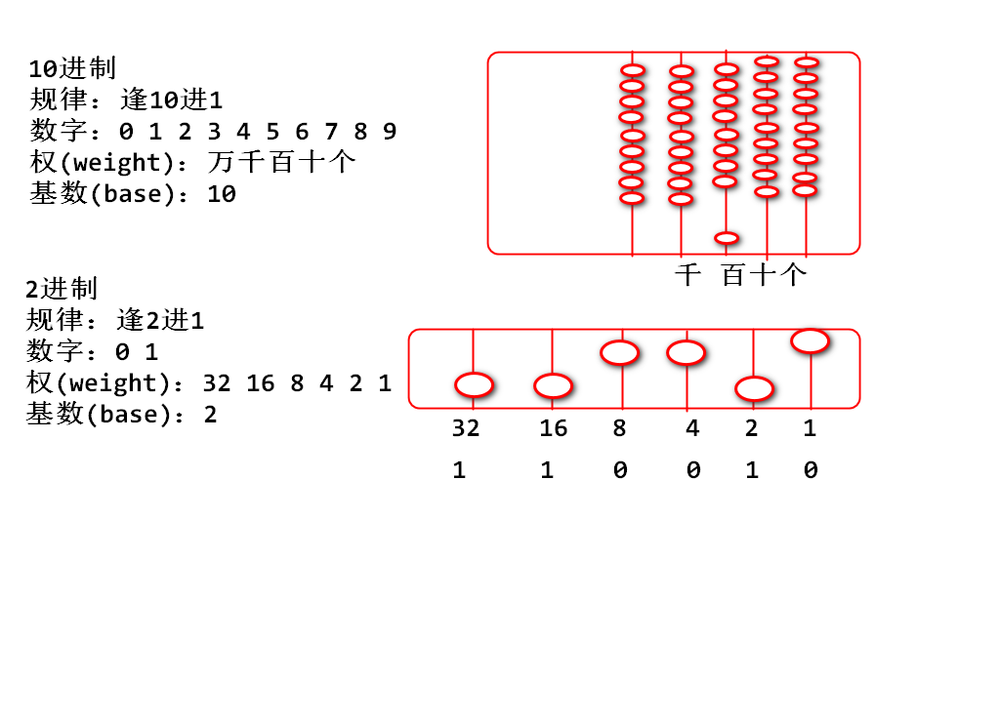
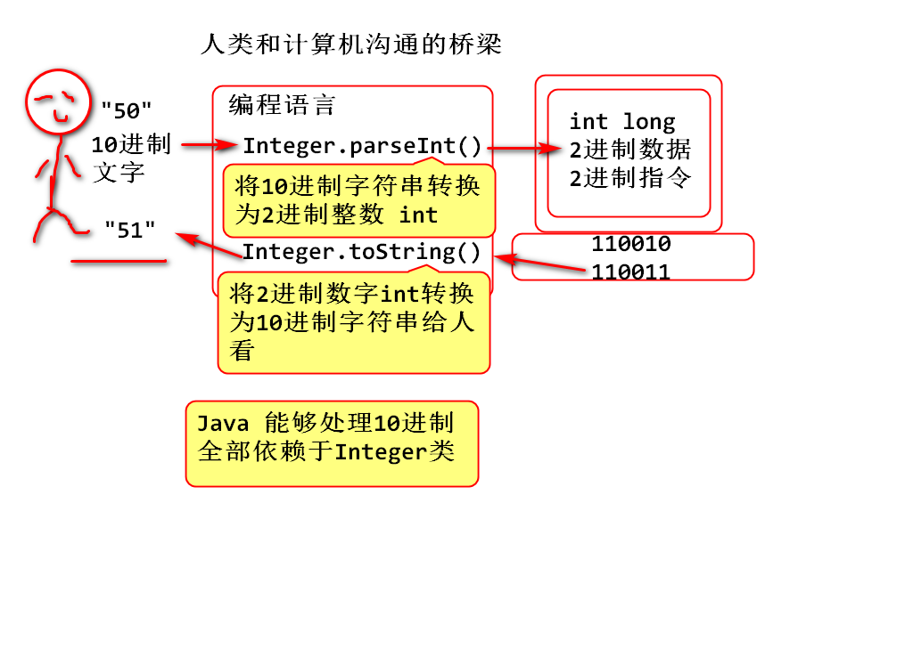

# 二进制

## 什么是2进制

逢2进1的计数规则。 



案例：

	public static void main(String[] args) {
		/**
		 * Java 数据底层都是2进制
		 */
		int n = 50;//110010
		System.out.println(n); //110010->"50"
		//toBinaryString(n)将n实际的2进制
		//转换为字符串，用于输出数字的2进制
		System.out.println(
			Integer.toBinaryString(n)); 
		
		for(int i=0; i<=150; i++) {
			System.out.println(
				Integer.toBinaryString(i)); 
		}
	}


## 计算机为啥使用2进制

2进制其设备制造成本低！适合规模化生产。 



# 16进制

16进制用于缩写（简写）2进制。

2进制书写繁琐、复杂、易错，由于16进制的基数是2的4次幂，所以16进制可以实现2进制的缩写，其中每4位2进制可以缩写为1位16进制。 

如何缩写： 从2进制最低位开始，每4位2进制可以缩写为1位16进制数字。 

# 补码

## 什么是补码

计算机中用于处理负数的一种编码规则，其核心思想是将固定位数的2进制数字分一半作为负数使用。 

以4位2进制为例子讲解编码规则：

1. 计算时候保持4位数不变，超出的4位的数据自动溢出。
2. 高位为0零的一半数字作为正数，高位为1零的一半数字作为负数
3. 计算时候，将10进制（包含负数）转换为底层2进制补码计算，计算结果也是2进制补码，再利用API转换为10进制数（包含负数）显示。
4. 补码是环形编码，最大值和最小值相接，相差1
5. （巧合）正数编码和负数编码互补对称，顾称为：补码

	
	11111111111111111111111111111111  -1
	                            8421                                  
	11111111111111111111111111111101  -3
	11111111111111111111111111111001  -7  


	11111111111111111111111111100011  -29
	00000000000000000000000000011100   28
	00000000000000000000000000011101   29

经典面试题目：

	System.out.println(~37);
	如上代码输出结果：( D )  A.-35 B.-36 C.-37 D.-38 

	System.out.println(~-37);
	如上代码输出结果：( B )  A.35 B.36 C.37 D.38 

# 2进制运算

运算符号：

	~ 取反
	& 与
	| 或
	>>> 逻辑右移位
	>> 数学右移位、
	<< 左移位

## & 与运算

运算规则（逻辑乘法）: 有0则为0
	
	0 & 0 = 0
	0 & 1 = 0
	1 & 0 = 0
	1 & 1 = 1 

>约定： 将两个2进制数数字对齐对应位子上的数字进行与计算

举个栗子：
				
			    b1       b2       b3       b4
	n =      00111011 01111110 10010101 10000101 
	m =      00000000 00000000 00000000 11111111  掩码（Mask 面具）
	b4 = n&m 00000000 00000000 00000000 10000101 

> 如上案例是掩码计算： 其结果k中存储的数据是数字n的最后8位数。

案例：

	int n = 0x3b7e9585;
	int m = 0xff; 
	int b4 = n & m;
	//按照2进制输出 n m b4

## >>>右移位运算 

运算规则： 将数字的每个位向右侧移动，移动后右侧多出的位自动溢出（舍弃），左从补充0 

举个例子：

	n=               01001111 10100110 11110001 10011110 
	m=n>>>1          001001111 10100110 11110001 1001111
	k=n>>>2          0001001111 10100110 11110001 100111
	n>>>8            00000000 01001111 10100110 11110001
	b3=(n>>>8)&0xff  00000000 00000000 00000000 11110001
	b2=(n>>>16)&0xff 00000000 00000000 00000000 10100110 
	b1=(n>>>24)&0xff 00000000 00000000 00000000 01001111

代码：

	int n = 0x4fa6f19e;
	int m = n>>>1;
	int k = n>>>2;
	int g = n>>>8;
	int b1 = (n>>>24) & 0xff;
	int b2 = (n>>>16) & 0xff;
	int b3 = (n>>>8) & 0xff;
	int b4 = n & 0xff;

## | 或计算 

基本规则：逻辑加法，有1则1
	
	0 | 0 = 0
	0 | 1 = 1
	1 | 0 = 1
	1 | 1 = 1

> 将两个2进制数对齐位置，对应的位置计算 或。 

举个例子：

	n =       00000000 00000000 00000000 11011101
	m =       00000000 00000000 11011101 00000000
	k = n|m   00000000 00000000 11011101 11011101

	b1=       00000000 00000000 00000000 10110100
	b2=       00000000 00000000 00000000 11101001
	b3=       00000000 00000000 00000000 11001011
	b4=       00000000 00000000 00000000 11110010

	(b1<<24)  10110100 00000000 00000000 00000000
	(b2<<16)  00000000 11101001 00000000 00000000 
	(b3<<8)   00000000 00000000 11001011 00000000 
	b4        00000000 00000000 00000000 11110010
	n = (b1<<24) | (b2<<16) | (b3<<8) | b4 
		         b1       b2       b3       b4
	n =       10110100 11101001 11001011 11110010

> 如上运算的意义：m和n两个拼接以后为k

案例:

	int n = 0xdd;
	int m = 0xdd00;
	int k = n|m;
	int b1 = 0xb4;
	int b2 = 0xe9;
	int b3 = 0xcb;
	int b4 = 0xf2;
	int num = (b1<<24) | (b2<<16) | (b3<<8) | b4;
	//检查 n m k b1 b2 b3 b4 num 的2进制

## 移位计算的数学意义

复习10进制移动小数点计算
	
	//       18319.
	//      183190. 扩大10倍
	//     1831900. 扩大100倍
	// 如果小数点不动，数字向左移动一次，扩大10倍

2进制移位：

	//      110010.   50
	//     1100100.  100  扩大2倍
	//    11001000.  200  扩大4倍
	//       11001.   25  缩小2倍
	//        1100.   12  缩小2倍, 小方向取整数

案例：

	int n = 50;
	int m = n<<1; //100 扩大2倍
	int k = n<<2; //200 扩大4倍 
	int g = n>>1; //25
	int p = n>>2; //12
	//输出 m k g p

## >>> 和 >> 的区别

`>>>` 逻辑右移位：将2进制数字向右移位，低位自动溢出舍弃，高位补0
`>>`  数学右移位：将2进制数字向右移位，低位自动溢出舍弃，正数补0，负数补1

举个例子：

	n =      11111111 11111111 11111111 11001110  -50
	m =n>>1  111111111 11111111 11111111 1100111  -25   
	k =n>>2  1111111111 11111111 11111111 110011  -13 小方向取整数
	g =n>>>1 011111111 11111111 11111111 1100111  比最大值少24

案例：

	int n = -50;
	int m = n>>1;
	int k = n>>2;
	int g = n>>>1;

> 如上结果说明 `>>` 计算是数学除法（小方向取整数）`>>>`不是数学除法，就是逻辑上将数组向右移动，不区分正负数。 

> 向右移动有符号问题，所以有两个运算符号，左移动只有一个符号 `<<` 

使用建议：

- 如果替代除法（2的整数幂）使用 `>>`
- 如果是拆分数据，就是实现数位的移动，就使用 `>>>` 

经典面试题目：

	n * 16 可以替换为 （ n<<4 ）	
	size/2 （size>0）可替换为 （ size>>1 ） 


## toBinaryString()

>把int类型变成二进制数据输出

例:
```
int a = 17;
System.out.println(Integer.toBinaryString(a));  //10001
```

## Integer.pareseInt()

>将10进制字符串转换成2进制整数

## Integer.toString()

>将2进制数字转换成10进制字符串给人看

**注意:Java能够处理10进制，全部依赖于Integer类**

#### Java 7支持直接书写2进制字面量，以0b开头

例:
```
int a = 0b10001;
System.out.println(a);   //17
```

#### 16进制以0x开头

例:
```
int b = 0x76;
System.out.println(b);   //118
```

#### 互补对称现象

>-n=~n+1  (先取反再加1，最小值除外)

例:
```
int a = -29;
int b = ~a;   //b=28
```

#### 掩码

>8位掩码。从最低位到高位有8位1.

例:
```
int m = 0xff;   //8位掩码 1111 1111
```


