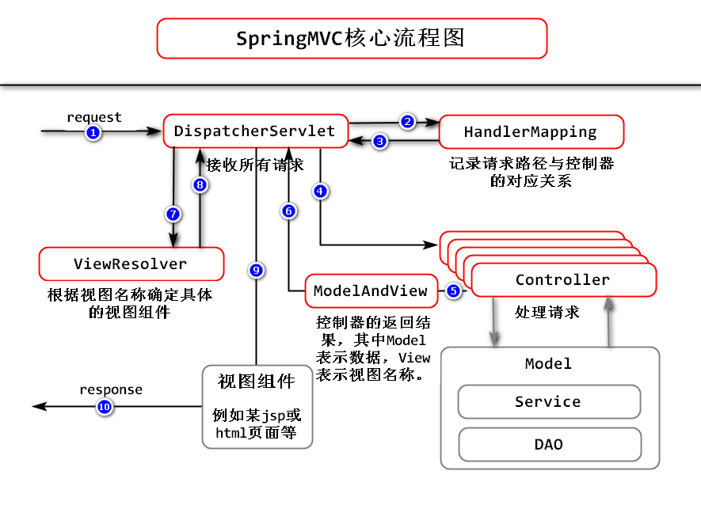

### SpringMVC框架

>SpringMVC框架的作用:解决了V-C交互的问题，即V(View:视图)和C(Controller:控制器)之间的交互问题。

>具体表现:用户可以通过视图将请求数据提交给服务器端的控制器，而控制器可以接收相关数据后进行处理，最终，给予客户端某个视图，使得客户端得到响应结果。



## 核心组件

1. `DispatcherServlet`:前端控制器，接收所有请求

2. `HandlerMapping`:记录请求路径与处理请求的控制器的对应关系

3. `Controller`:具体处理请求的组件

4. `ModelAndView`:控制器的返回结果，其中得到的Model表示数据，View表示视图

5. `ViewResolver`:根据视图名称确定具体的视图组件

```
1.用户发送请求至前端控制器DispatcherServlet。
2.DispatcherServlet收到请求调用HandlerMapping处理器映射器。
3.处理器映射器根据请求url找到具体的处理器，生成处理器对象及处理器拦截器(如果有则生成)一并返回给DispatcherServlet。
4.DispatcherServlet通过HandlerAdapter处理器适配器调用处理器。
5.执行处理器(Controller，也叫后端控制器)。
6.Controller执行完成返回ModelAndView。
7.HandlerAdapter将controller执行结果ModelAndView返回给DispatcherServlet。
8.DispatcherServlet将ModelAndView传给ViewReslover视图解析器。
9.ViewReslover解析后返回具体View。
10.DispatcherServlet对View进行渲染视图（即将模型数据填充至视图中）。
11.DispatcherServlet响应用户。
```
https://www.cnblogs.com/leiqiannian/p/7807579.html

## Spring MVC九大内置对象

request,response,session,aplication,Exception,out,page,pagecontext,config

>四大作用域:Page,request,session,application

#### 使用SpringMVC

1.配置spring-webmvc依赖
```
<dependency>
  <groupId>org.springframework</groupId>
  <artifactId>spring-webmvc</artifactId>
  <version>4.3.9.RELEASE</version> //4.2或以上版本即可
</dependency>
```

2.在web.xml配置DispatcherServlet使之接收所有请求

>在SpringMVC框架中已经定义了`DispatcherServlet`，用于接收所有请求，它终究是一个`Servlet`，必须在**web.xml**文件中进行配置，否则，当启动Tomcat时，它根本就不会工作！

```
然后，SpringMVC框架是基于Spring框架的，应该在项目启动时就加载Spring的配置文件，
使得相关配置是生效的！在`DispatcherServlet`的父类`FrameworkServlet`中，定义了
`contextConfigLocation`属性，该属性的值应该是Spring配置文件的位置，当设置了值以
后，初始化`DispatcherServlet`时，就会自动读取Spring的配置文件！

<servlet>
    <servlet-name>SpringMVC</servlet-name>
    <servlet-class>
    	org.springframework.web.servlet.DispatcherServlet
    </servlet-class>
    <init-param>
        <param-name>contextConfigLocation</param-name>
        <param-value>classpath:spring.xml</param-value>
    </init-param>
    <load-on-startup>1</load-on-startup>
</servlet>

<servlet-mapping>
    <servlet-name>SpringMVC</servlet-name>
    <url-pattern>*.do</url-pattern>  //后缀为.do的所有路径
</servlet-mapping>
```

**注意：Spring的配置文件应该在src/main/resources下，并且文件名应该是spring.xml，与以上配置保持一致！**

1.配置完成后，在**spring.xml**中配置组件扫描：

	<context:component-scan base-package="cn.climber.spring" />

2.然后src/main/java创建测试类：

	package cn.climber.spring;
	import org.springframework.stereotype.Component;
	
	@Component
	public class Tests {
		public Tests() {
			System.out.println("Tests()");
		}
	}

3.最后，将项目部署到Tomcat，启动Tomcat，在控制台可以看到以上构造方法中输出的内容！

## 使用控制器接收请求

**注意：控制器类必须放在组件扫描范围之内！**

例:
```
@Controller //添加@Controller注解
public class HelloController {
	//使用@RequestMapping注解，配置其对应的请求路径：
	@RequestMapping("hello.do")
	public String showHello() {
		System.out.println("HelloController.showHello");
		return null;
	}
}

以上配置，就实现了请求路径与处理请求的方法的对应关系，当客户端提交了hello.do路径的请求时，SpringMVC框架就会自动调用其对应的showHello()方法进行处理！
```

## 显示页面

>在**webapp/WEB-INF**下创建名为**templates**的文件夹，然后，在该文件夹中创建html文件。

1.使用Thymeleaf实现界面，pom.xml添加`thymeleaf`和`thymeleaf-spring4`这2项依赖：
```
<dependency>
    <groupId>org.thymeleaf</groupId>
    <artifactId>thymeleaf</artifactId>
    <version>3.0.9.RELEASE</version>
</dependency>

<dependency>
    <groupId>org.thymeleaf</groupId>
    <artifactId>thymeleaf-spring4</artifactId>
    <version>3.0.9.RELEASE</version>
</dependency>
```

2.在Spring.xml配置文件中配置**ServletContextTemplateResolver模版解析器**，根据模版解析器得到**SpringTemplateEngine模版引擎**，然后再基于模版引擎得到**ThymeleafViewResolver视图解析器**

例:
```
<!-- 模版解析器 -->
<bean id="templateResolver"
    class="org.thymeleaf.spring4.templateresolver.SpringResourceTemplateResolver">
    <property name="prefix" value="/WEB-INF/templates/" />
    <property name="suffix" value=".html" />
    <property name="characterEncoding" value="utf-8" />
    <property name="templateMode" value="HTML" />
    <property name="cacheable" value="false" />
</bean>

<!-- 模版引擎 -->
<bean id="templateEngine" 
    class="org.thymeleaf.spring4.SpringTemplateEngine">
    <property name="templateResolver"
        ref="templateResolver" />
</bean>

<!-- 视图解析器 -->
<bean class="org.thymeleaf.spring4.view.ThymeleafViewResolver">
    <property name="templateEngine"
        ref="templateEngine" />
    <property name="characterEncoding" value="utf-8" />
</bean>
```

## 使用SpringMVC接收请求参数

#### 创建控制器接收并处理请求

>在Spring的xml配置文件中配置了组件扫描的包中创建控制器类，在类之前添加`@Controller`注解，然后，在类中添加2个方法，处理所设计的请求

例:
```
@Controller
public class UserController {
    public UserController() {
        System.out.println("UserController()");
    }

    @RequestMapping("reg.do")
    public String showRegister() {
        System.out.println("UserController.showRegister()");
        return "reg";
    }
}
```

##### 通过HttpServletRequest接收请求参数 【不推荐】

>可以在处理请求的方法的参数列表中添加`HttpServletRequest`类型的参数，然后，在方法体中，调用参数对象的`String getParameter(String name)`方法即可获取客户端提交的请求参数

例:
```
@RequestMapping("handle_register.do")
public String handleRegister(HttpServletRequest request) {
    String username = request.getParameter("username");
    System.out.println("username=" + username);

    return null;
}
```

不推荐这种方法的主要问题有:

1. 编写代码比较麻烦；
2. 如果期望的数据类型不是`String`类型，需要自行转换类型；
3. 不便于执行单元测试。

##### 直接将请求参数声明为处理请求的方法的参数 【推荐】

>可以将客户端提交的请求参数，直接声明为处理请求的方法的参数，甚至，还可以将这些参数的类型声明为所期望的类型，例如“年龄”的类型直接声明为`Integer`即可，SpringMVC框架会自动完成数据类型的转换，当然，务必保证客户端所提交的数据是可以被转换成`Integer`的，否则，可能出现异常。参数名要和客户端传过来的参数名相同

例:
```
@RequestMapping("handle_register.do")
public String handleRegister(String username, String password, Integer age) {

    System.out.println("username=" + username);
    System.out.println("password=" + password);
    System.out.println("age=" + (age + 1));
    return null;
}
```

**使用这种做法时，需要保证请求参数的名称，与方法的参数名称保持一致！如果名称不一致，则服务器端的方法的参数值将是`null`值。**

##### 将请求参数封装并使用封装的类型作为方法参数 【推荐】

例:
```
public class User {
    private String username;
    private String password;
    
    get和set方法，toString方法
}


@RequestMapping("handle_register.do")
public String handleRegister(User user) {
    System.out.println(user);
    return null;  
    //返回的字符串会根据spring.xml配置的，路径跟后缀跳转页面
}
```

## 使用SpringMVC处理响应结果的页面

>使用HttpServletRequest封装数据 【不推荐】

例:
```
@RequestMapping("handle_login.do")
public String handleLogin(String username, String password, 
        HttpServletRequest request) {

    String errorMessage = null;
    if ("root".equals(username)) {
        if ("1234".equals(password)) {
            // 用户名和密码都是正确的
            return null;
        } else {
            // 密码错
            errorMessage = "登录失败！密码错误！";
            // 使用errMsg作为名称来封装数据
            request.setAttribute("errMsg", errorMessage);
            // 跳转到页面
            return "error";
        }
    } else {
        // 用户名错
        errorMessage = "登录失败！用户名不存在！";
        // 使用errMsg作为名称来封装数据
        request.setAttribute("errMsg", errorMessage);
        // 跳转到页面
        return "error";
    }
}

封装完成后，在页面使用Thymeleaf中的表达式显示数据即可，例如：
<h2 th:text="${errMsg}">原因是XXXXXX</h2>
```

**通常，在处理请求的方法的参数中添加`HttpServletRequest`类型参数的做法都是不推荐的，至少存在“不便于执行单元测试”的缺陷！**

>使用ModelMap封装数据 【推荐】

**这种做法与使用`HttpServletRequest`封装数据的做法基本一致，也是在处理请求的方法的参数列表中添加参数，只不过新的参数类型是`ModelMap`类型的，封装数据时，调用的方法是`addAttribute(String, Object)`**

例:
```
@RequestMapping("handle_login.do")
public String handleLogin(String username, String password, 
        ModelMap modelMap) {
        
    String errorMessage = null;
    if ("root".equals(username)) {
        if ("1234".equals(password)) {
            // 用户名和密码都是正确的
            return null;
        } else {
            // 密码错
            errorMessage = "登录失败！密码错误！";
            // 使用errMsg作为名称来封装数据
            modelMap.addAttribute("errMsg", errorMessage);
            // 跳转到页面
            return "error";
        }
    } else {
        // 用户名错
        errorMessage = "登录失败！用户名不存在！";
        // 使用errMsg作为名称来封装数据
        modelMap.addAttribute("errMsg", errorMessage);
        // 跳转到页面
        return "error";
    }
}
```
相比之下，使用`ModelMap`的优点就有“便于执行单元测试”，另外，这种数据类型更加**轻量级**。

>使用ModelAndView作为处理请求的方法的返回值(麻烦) 【不推荐】

例:
```
@RequestMapping("handle_login.do")
public ModelAndView handleLogin(String username, String password) {

    ModelAndView mav = null;
    String errorMessage = null;
    if ("root".equals(username)) {
        if ("1234".equals(password)) {
            // 用户名和密码都是正确的
            return null;
        } else {
            // 密码错
            errorMessage = "登录失败！密码错误！";
            // 使用errMsg作为名称来封装数据
            Map<String, Object> model = new HashMap<String, Object>();
            model.put("errMsg", errorMessage);
            mav = new ModelAndView("error", model);
            // 跳转到页面
            return mav;
        }
    } else {
        // 用户名错
        errorMessage = "登录失败！用户名不存在！";
        // 使用errMsg作为名称来封装数据
        mav = new ModelAndView();
        mav.setViewName("error");
        mav.addObject("errMsg", errorMessage);
        // 跳转到页面
        return mav;
    }
}
```

## 转发与重定向

>当控制器需要向客户端响应某个页面时，可以使用转发，或重定向！

**转发:**1次请求，使用转发时，其主要原因在于“可以在控制器类中通过Java代码处理用户的请求，并得到数据，但是，在控制器类中不便于直接向客户端响应某个页面，则可以把数据转发给视图组件，例如JSP页面，或Thymeleaf的html，这些视图组件得到数据后，通过其支持的表达式等语法将数据拼到原本设计的页面中，最后，将拼好了数据的HTML源代码响应给客户端”，所以，转发的根本原因是控制器便于处理数据，却不便于呈现数据，“自己不擅长的时候请别人帮忙做”。


**重定向：**是2次请求，当请求到控制器后，控制器会要求客户端进行重定向，会响应302响应码，并给客户端目标地址，然后客户端会根据目标地址发出第2次请求，所以，在重定向时，客户端的浏览器中的URL会是第2次请求的URL！

- 在SpringMVC中，如果需要重定向，可以将方法的返回值类型声明为`String`类型，在返回值时，返回`redirect:`及目标路径组成的字符串，例如`return "redirect:index.do";`。另外，在转发时，也可以添加`forward:`前缀，由于默认的处理方式就是转发，所以，不必显式的添加该前缀。

例:
```
@RequestMapping("handle_login.do")
public String handlerLogin(String username,String password,ModelMap modelMap) {
    String errorMessage = null;
    if("root".equals(username)) {
        if("1234".equals(password)) {
            //重定向到index.do
            return "redirect:index.do";
        }else {
            //密码错
            errorMessage ="登录失败!密码错误";
            //使用errMsg作为名称传到页面
            modelMap.addAttribute("errMsg", errorMessage);
            return "error";  //返回的字符串会根据spring.xml配置的，路径跟后缀跳转页面
        }

    }else {
        //用户名错
        errorMessage = "登录失败!用户名不存在";
        //使用errMsg作为名称传到页面
        modelMap.addAttribute("errMsg", errorMessage);
        return "error";
    }
}
```

>转发与重定向区别

    	转发时，客户端只发出了1次请求，在浏览器的地址栏中显示的URL就是请求的URL，如果提交的请求是POST请求，
	刷新时还会重新提交请求数据；重定向时，客户端发出了2次请求，第1次请求时，服务器端会响应302状态码及重
	定向的目标路径，客户端再次自动发出第2次请求，最终在浏览器的地址栏中显示的URL是第2次请求的URL，在刷新
	只也会向第2个请求路径再次发出请求。

##  关于@RequestMapping

>在方法的声明之前添加`@RequestMapping`注解，用于配置请求路径与处理请求的方法的映射关系！

也可以类的声明之前添加该注解，则当前类中所有处理请求的路径之前都会添加配置值，类似于多了一层文件夹！

例:
```
@Controller
@RequestMapping("user")
public class UserController { }

如果该类中此前存在reg.do的请求路径，在添加配置后，就会变为user/reg.do 建议为每一个控制器类都添加该注解！

在类或方法之前添加`@RequestMapping`配置路径时，会忽略最左侧和最右侧的`/`符号
```

##### 可以通过`value`属性配置请求路径

>使用该注解时，可以通过`value`属性配置请求路径，该属性的值是`String[]`数组类型的，在配置过程中，可以使用`String`作为值，也可以使用`String[]`作为值，并且，该属性是默认属性

例:
```
@RequestMapping("reg.do")
@RequestMapping(value="reg.do") 
@RequestMapping({"reg.do"})
@RequestMapping(value={"reg.do"})  

以上4种配置方式是完全等效的！

另外，如果需要为同1个方法配置多种请求路径，可以配置为：
@RequestMapping({"reg.do", "register.do"})
@RequestMapping(value={"reg.do", "register.do"})

在配置`@RequestMapping`注解中的属性时，`value`属性与`path`属性是完全等效的！`path`属性是从4.2版本加入的！
@RequestMapping(path={"reg.do", "register.do"})
```

##### 通过method属性限制请求方式

>如果把某个请求路径限制为`POST`类型的请求，实际通过`GET`方式发出请求后，服务器端会响应405状态码，HTTP Status 405 – Method Not Allowed;Message:Request method 'GET' not supported

例:
```
@RequestMapping(value= {"reg.do","register.do"},method= {RequestMethod.POST,RequestMethod.GET})
public String showRegister() { }
```

## @RequestParam

>可以在处理请求的方法的参数之前添加`@RequestParam`注解！

1. 通过配置`name`/`value`属性可以解决客户端提交的参数名称与服务器端要求的名称不一致的问题

例:
```
public String handleLogin(RequestParam(name="uname") String username, String password, ModelMap modelMap)

客户端按照`uname`这个名称来提交请求参数即可，而在服务器端开发时依然使用`username`这个名称！

一旦添加了该默认后，默认情况下，客户端提交请求时，必须提交参数，如果没有提交，则服务器会响应400！(没有加注解之前，如果没有提交，服务器会按照`null`值来处理)
HTTP Status 400 – Bad Request
Message:Required String parameter 'uname' is not present
```

2. required 设置该请求参数是否为必须的，默认为true(必填)

**如果并不是强制要求提交该参数，可以显式的将属性设置为`false`**

例：
```
@RequestParam(name="uname", required=false) String username
```

3. defaultValue 客户端没有传参数给服务端时，服务端自己设的默认值

> 当需要设置defaultValue属性以配置默认值时，需要显式的将required设置为false，否则，配置的defaultValue将没有意义！

例:
```
@RequestParam(value="uname",required=false,defaultValue="admin")
```

#### 总结:在哪些情况下需要使用`@RequestParam`注解？

1. 请求参数的名称，与控制器中处理请求的方法的参数名称不一致时；

2. 强制要求客户端必须提交某些参数的值；

3. 不要求客户端提交某个参数，且为其设置默认值时。

## SpringMVC中请求参数乱码的问题

>在SpringMVC框架中，已经定义了`CharacterEncodingFilter`过滤器类，在该类中有名为`encoding`的属性，表示将使用的字符编码，并且，该过滤器会把该编码应用于接收请求参数及响应数据，所以，应该在**web.xml**中配置该过滤器类，并设置初始化参数，以确定`encoding`属性的值，以此来解决接收请求参数及响应时的乱码问题

例:
```
<filter>
    <filter-name>CharacterEncodingFilter</filter-name>
    <filter-class>org.springframework.web.filter.CharacterEncodingFilter</filter-class>
    <init-param>
        <param-name>encoding</param-name>
        <param-value>utf-8</param-value>
    </init-param>
</filter>

<filter-mapping>
    <filter-name>CharacterEncodingFilter</filter-name>
    <url-pattern>/*</url-pattern>
</filter-mapping>
```

## 服务器向客户端响应正文

>在SpringMVC项目中，可以将处理请求的方法的返回值类型设置为`String`，表示需要响应的正文，然后，在方法之前添加`@ResponseBody`注解，表示本次响应将不再是转发或重定向，而是直接将方法的返回值响应给客户端，其它配置或操作与一般的SpringMVC项目完全相同

```
@Controller
public class HelloController {
    @RequestMapping("hello.do")
    @ResponseBody
    public String showHello() {
        System.out.println("HelloController.showHello()");
        return "success";
    }
}
```
**由于默认的响应头中设置的Content-Type值为text/html; charset=ISO-8859-1，所以，默认情况下，如果直接返回中文，在浏览器中看到的会是乱码！**

## 服务器向客户端响应JSON格式的数据

1. 在服务器端创建cn.climber.ajax.User类，在类中声明属性：

```
public class User {
    private Integer id;
    private String username;
    private String password;
    private Integer age;
    private String phone;
    private String email;
    //get和set方法，toString方法
}
```
	
2. 然后，在项目中添加jackson依赖：

```
<dependency>
    <groupId>com.fasterxml.jackson.core</groupId>
    <artifactId>jackson-databind</artifactId>
    <version>2.9.8</version>
</dependency>
```
3. 还需要Spring的配置文件中添加配置：

```
<!-- 注解驱动 -->
<mvc:annotation-driven />
```

以上添加的jackson依赖可以自动将处理请求的方法返回的对象组织为JSON数据格式。

当SpringMVC框架向客户端响应正文时，框架内部需要使用Converter(转换器)将方法的返回值转换为字符串响应给客户端，如果返回值的类型是`String`类型，会使用`StringHttpMessageConverter`转换器，如果返回值的类型是SpringMVC框架默认不可识别的类型(例如开发者自定义的数据类型)，将会自动使用Jackson框架内部的转换器，Jackson框架内部的转换器会自动将对象转换为JSON格式的字符串，并且，在响应头(Response Headers)中，将`Content-Type`值设置为`application/json;charset=utf-8`，所以，响应的数据中是可以包含中文的！

4. 返回JSON数据

```
@Controller
public class HelloController {
	@RequestMapping("hello.do")
	@ResponseBody
	public User showHello() {
		System.out.println("HelloController.showHello");
		User user = new User();
		user.setId(1);
		user.setUsername("John");
		user.setPassword("123456");
		user.setAge(23);
		user.setPhone("13800138001");
		user.setEmail("john@tedu.cn");
		return user;
	}
}
```
**小结：当服务器需要向客户端响应JSON格式的数据时，应该自定义某个数据类型，把要响应的属性设计为该类的属性，然后，在控件器处理请求的方法中，返回该类型的对象即可！**

### 附1：GET与POST的区别

GET请求的请求数据是暴露在URL中的，所以，不适合提交带有敏感数据(涉及隐私的、涉及安全的等等)的应用场景，也不适合请求数据过多的应用场景；POST请求是将请求数据封装在请求体中，不会暴露出来，相对而言，能够保证数据的隐私的安全不被侵犯，也能够封装较大甚至特别大的数据。

尽管POST优点更多，但是，并不能完全取代GET，因为POST类型的请求不会把请求数据体现在URL中，则不适用于分享、收藏相关操作！

从网络访问的过程来看，GET请求其实更快，可以将请求数据一次性提交到服务器端，而POST请求的访问过程是先不带参数连接服务器，当服务器确认后，客户端再次请求服务器，并提交相关参数！

> 关于GET请求数据长度的限制，建议理解为2K，具体值需要根据客户端和服务器端共同决定。

### 附2：解决乱码问题

计算机只能直接识别并处理二进制数，即由0和1组成的序列！

每1个0，或每1个1，在存储设备中，占用的空间是1个二进制位(bit)，在实际应用时，会使用最基本的单位字节(byte)来表示数据，每1个字节占8个二进制位。

早期使用**ASCII码**制定阿拉伯数字、英文字母、标点符号与二进制数的对应关系，例如使用`100 0001`对应字母`a`。

为了保证全世界的各个国家、各个民族使用的字、符号都可以被识别，就出现了Unicode编码，这种编码记录了所有字、符号！

但是，Unicode编码并不能直接应用于数据的传输！所以，就出现了UTF(Unicode Transformation Format)系列编码，以UTF-8为例，这种编码就约定了每个字节中应该有某些位置并不表示编码，而是表示其它特殊的意义，以3字节的数据为例，某个字符的编码可能是：

	1110 1000	10 111001	10 001011

即：第1个字节中，使用3个1和1个0，表示从这个字节开始，接下来3个字节用于表示同1个字符，后续的每一个字节都以10作为前缀，后6位才表示编码。

同理，如果某个字符是由2字节组成的，其UTF-8编码可能是：

	110 10101	10 110001

如果某个字符是由4字节组成的，其UTF-8编码可能是：

	11110 101	10 111100	10 101010	10 110011

可以发现，数据在传输过程中，编码是有一定的规则的，并不是每一位都具有“编码”的含义，如果发送数据时使用UTF-8，而接收数据的一方并不采取相同的规则，则可能误解读其中的某些数据，从而导致解读失败，就会出现乱码！

所以，出现乱码的主要原因是：读和写/发送与接收使用的编码并不统一，甚至使用了不支持中文的编码所导致的！

解决方案也非常简单：能够设置编码的位置，全部设置相同的、支持中文的编码即可！


